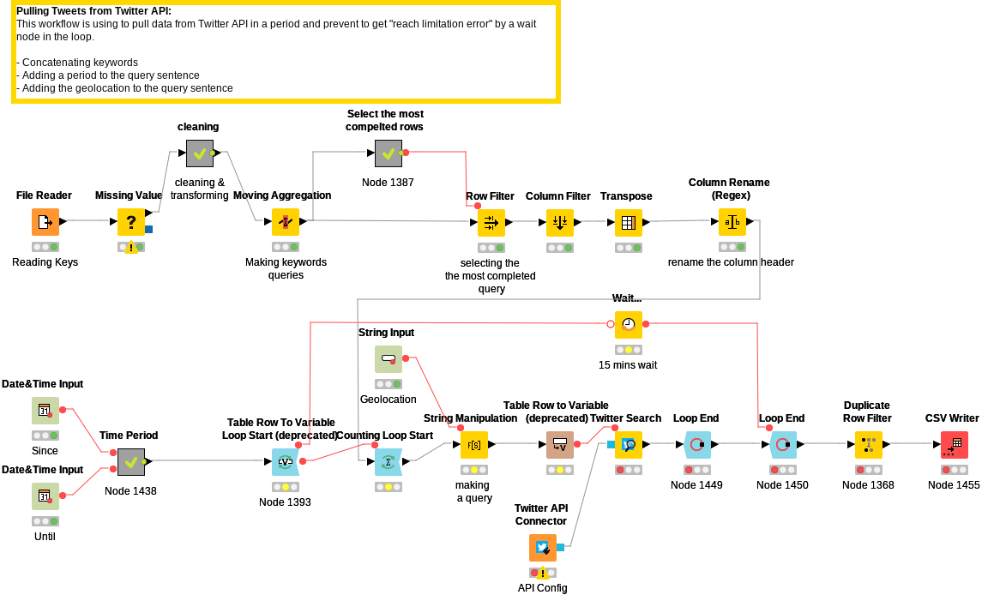
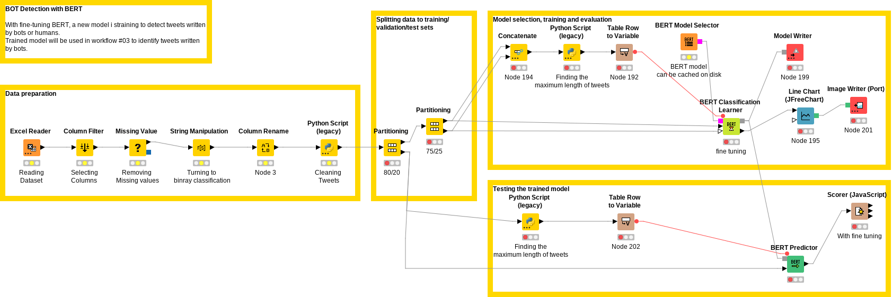
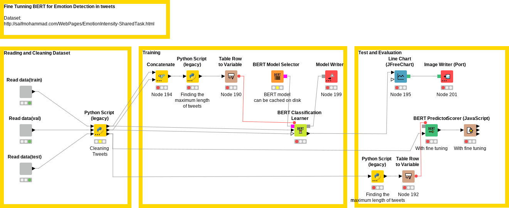
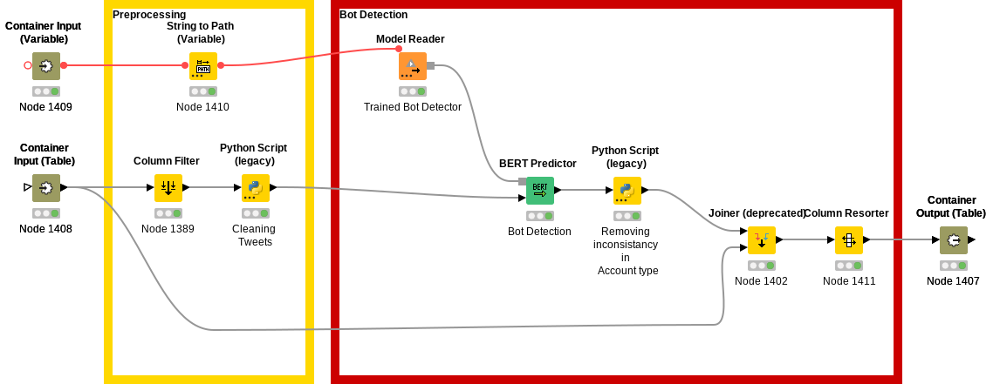
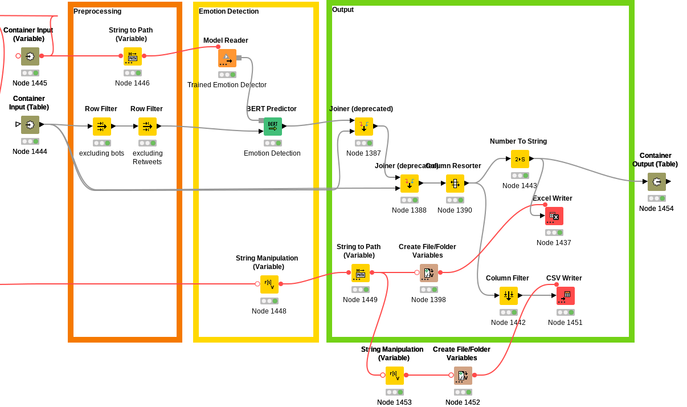
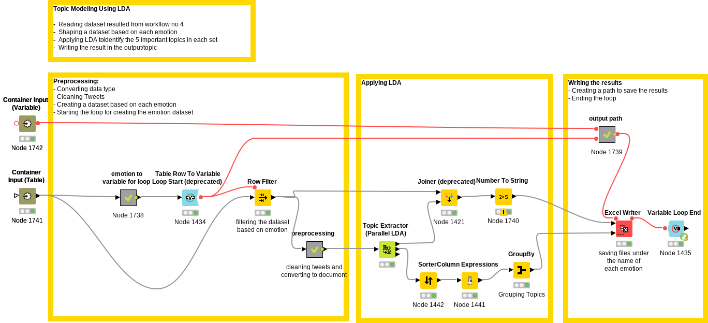
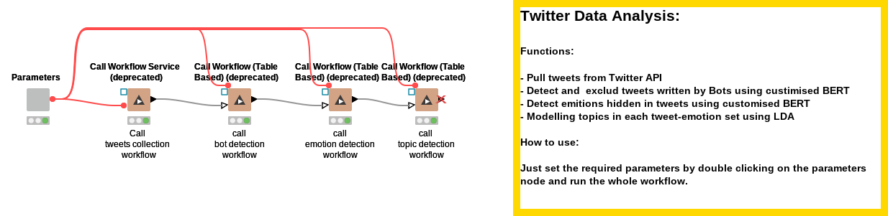

# Emotion Detection on Twitter

Knowing what the public is thinking and feeling, is an important factor to respond properly to social events. Since COVID-19 pandemic outbreak, people have been expressing their thoughts and feeling about the pandemic on social networks. With analysing this data, authorities could target measures likely success of the health protection interventions that require public compliance to be effective.  
In this project, we benefitted from some Natural Language Processing (NLP) techniques, lexicon-based, supervised and unsupervised, to get insight from Twitter on COVID-19 pandemic. To this end, we analysed Wikipedia to extract the most recent related keywords to pull data from Twitter API and build the required dataset. Considering the main goal of the project, detecting and analysing emotions, we identified and filtered out tweets written by bots on Twitter. Finally, benefitting from a pre-trained version of Bidirectional Encoder Representations from Transformers BERT, we built a model to detect emotions in form of fear, anger, joy and sadness hidden in tweets.  

**1.Extracting Covid-19 related keywords:** 
Talking it through with an expert, the following Wikipedia pages were used to extracted keywords: 
* [COVID-19 pandemic in the United Kingdom](https://en.wikipedia.org/wiki/COVID-19_pandemic_in_the_United_Kingdom)
* [NHS Test and Trace](https://en.wikipedia.org/wiki/NHS_Test_and_Trace)
* [Coronavirus disease 2019](https://en.wikipedia.org/wiki/Coronavirus_disease_2019) 

**2.Bot detection:** 
To detect tweets written by bots, we manually labelled a subset of pulled data. This dataset is accessible [here.](https://github.com/ehsantaati/Twitter_PHD/blob/master/data/raw/tweet_df.csv) 

**3.Emotion Detection:** 
According to transfer learning rules, we retrained a pre-trained version of BERT ([“bert-large-uncased”](https://huggingface.co/bert-base-uncased)) in Pytorch on [WASSA-2017](http://saifmohammad.com/WebPages/EmotionIntensity-SharedTask.html) dataset.  

Weights of trained models are acessible [here.](https://drive.google.com/drive/folders/1T2HRbHJRLrc4sie3aekrkd_VYDQiSqz9?usp=sharing)

## Environment:
* Pytorch
* Sckitlearn
* To install required packeges:`pip install -r requirements.txt`

## References:
* https://huggingface.co/bert-base-uncased
* http://saifmohammad.com/WebPages/EmotionIntensity-SharedTask.html

## Business Contribution:
During the COVID-19 pandemic, understanding public sentiment was crucial for public health decision-makers. To address this need, [Public Health Dorset](https://www.publichealthdorset.org.uk) implemented a data analytics pipeline. This pipeline retrieved relevant tweets from the Twitter API, filtered out non-human accounts, and then analyzed the remaining tweets for four primary emotions. Additionally, topic modeling was employed to identify the underlying causes of these emotions.
This pipeline was implemented on Knime including the following workflows:

**1- [Collecting related tweettes from Twitter API](https://hub.knime.com/-/spaces/-/~a1so1UnYcIAwYAiY/current-state/)** 
To identify COVID-19-related discussions, we extracted keywords from relevant Wikipedia articles. Utilizing these keywords, along with location filters for Bournemouth, Poole, Christchurch, and Dorset, and time-based parameters, we retrieved tweets from the Twitter API using the following workflow:  

**2- Fine-Tuning BERT as a Bot Detector**  

**3- Fine-Tuning BERT as an Emotion Detector**  

**4- Deploying Trained Models**  
   
   
**5- Identifying Emotions' Triggers using Topic Modelling by LDA**  
  
**6- Automated Data Flow**   
 

    Your text goes here.

